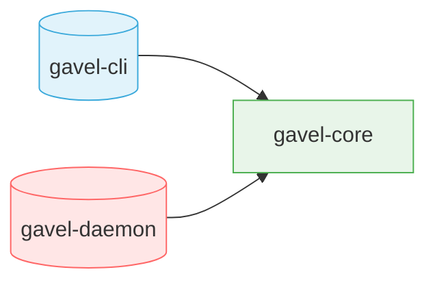
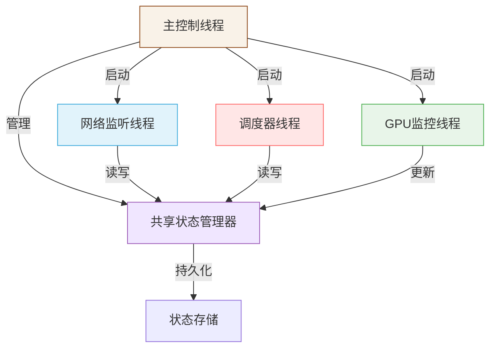
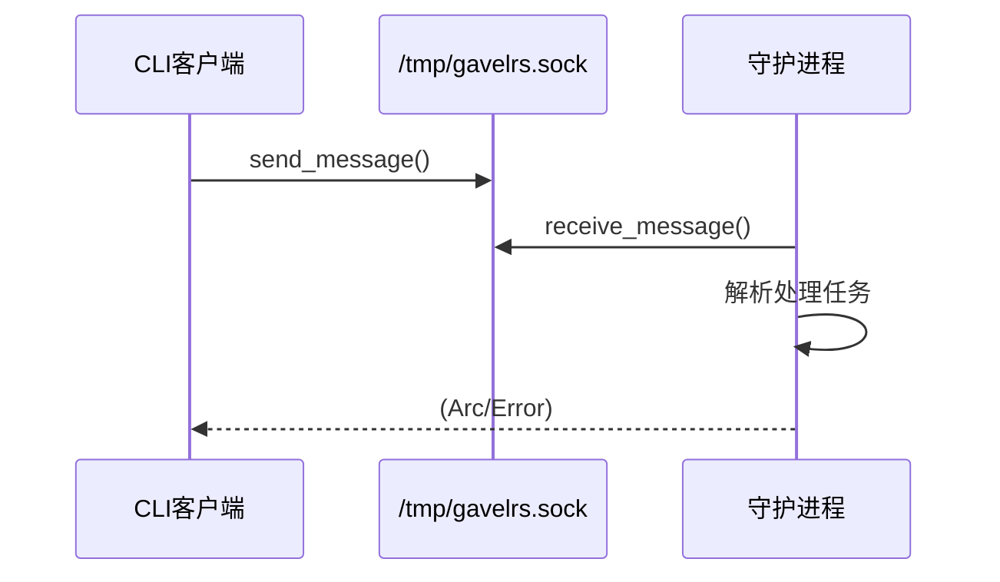
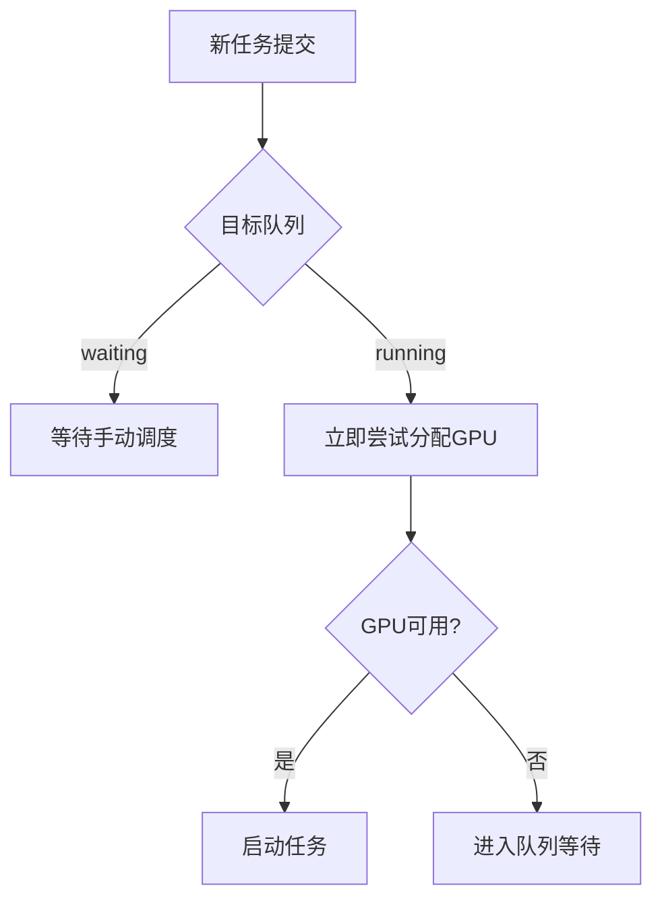

# gavelrs 的设计（单用户无root的gpu调度管理）


## 命令行概览
`gavelrs [COMMAND] [SUBCOMMAND] [OPTIONS]`

监控程序管理:
```shell
gavelrs daemon init --config <FILE>    # 初始化守护进程(指定配置文件)
gavelrs daemon stop                    # 停止守护进程
gavelrs daemon status                  # 查看守护进程状态
```

任务提交:
```shell
gavelrs submit command --cmd <CMD> --gpu_num <gpu_num>    # 提交命令行任务
gavelrs submit script --file <FILE> --gpu_num <gpu_num>   # 提交脚本文件任务
gavelrs submit json --file <JSON> --queue <QUEUE_NAME>    # 提交JSON定义的任务(其实是定义了一系列符合格式的任务)
```

任务管理:
```shell
gavelrs task list [--all|--running]    # 列出任务(默认显示未完成)
gavelrs task info <TASK_ID>            # 查看任务详细信息
gavelrs task run <TASK_ID>             # 将 task 添加进running队列
gavelrs task kill <TASK_ID>            # 终止指定任务
gavelrs task logs <TASK_ID> [--tail]   # 查看任务日志
```

GPU资源管理:
```shell
gavelrs gpu list                       # 显示所有GPU状态
gavelrs gpu info [GPU_ID]              # 查看GPU详细信息
gavelrs gpu allocate [GPU_IDS] <QUEUE_NAME> # 申请GPU资源
gavelrs gpu release <GPU_ID>           # 释放GPU分配（这将结束该GPU上所有gavelrs分配的任务）
gavelrs gpu ignore <GPU_ID>            # 忽略指定GPU，即该GPU将不会被任何queue拥有
```

队列管理:
```shell
gavelrs queue list                     # 列出所有队列状态
gavelrs queue status <QUEUE_NAME>      # 查看调度队列状态
gavelrs queue merge --from <SOURCE_QUEUE> --to <DEST_QUEUE> # 将队列A中的所有任务移动到队列B
gavelrs queue create <QUEUE_NAME>      # 新建一个队列
gavelrs queue move <TASK_ID> <QUEUE_NAME> # 将任务移动到队列
gavel-cli queue set-limit <queue-name> --max-util <max-util> --mem-type <mem-type> --mem-value <mem-value> # 设置队列的资源限制
```

表格式
| 模块        | 命令结构                            | 参数说明                          | 功能描述                           |
|-------------|-----------------------------------|-----------------------------------|----------------------------------|
| **Daemon**  | `daemon init`                    | `--config <FILE>`                | 加载指定配置文件初始化守护进程     |
|             | `daemon stop`                    | _无参数_                         | 立即停止守护进程                 |
|             | `daemon status`                  | _无参数_                         | 显示守护进程运行状态             |
| **Submit**  | `submit command`                 | `--cmd <CMD> --gpu_num <NUM>`    | 提交需要GPU资源的命令行任务       |
|             | `submit script`                  | `--file <FILE> --gpu_num <NUM>`  | 提交包含GPU需求的脚本文件         |
|             | `submit json`                    | `--file <JSON> --queue <QUEUE>`  | 批量提交JSON格式任务到指定队列    |
| **Task**    | `task list`                      | `[--all\--running]`              | 过滤显示全部/运行中的任务        |
|             | `task info <TASK_ID>`            | _无参数_                         | 显示任务详细信息（含资源占用）   |
|             | `task run <TASK_ID>`             | _无参数_                         | 将任务加入运行队列               |
|             | `task kill <TASK_ID>`            | _无参数_                         | 强制终止指定任务                 |
|             | `task logs <TASK_ID>`            | `[--tail]`                       | 查看日志（实时追踪模式）         |
| **GPU**     | `gpu list`                       | _无参数_                         | 显示所有GPU的实时状态            |
|             | `gpu info`                       | `[GPU_ID]`                       | 查看指定GPU详细信息（默认全部）  |
|             | `gpu allocate`                   | `[GPU_IDS] <QUEUE>`              | 将GPU资源绑定到指定队列          |
|             | `gpu release <GPU_ID>`           | _无参数_                         | 释放GPU并终止关联任务            |
|             | `gpu ignore <GPU_ID>`            | _无参数_                         | 从调度系统中排除指定GPU          |
| **Queue**   | `queue list`                     | _无参数_                         | 显示所有队列及其资源分配         |
|             | `queue status <QUEUE>`           | _无参数_                         | 显示指定队列的详细状态           |
|             | `queue merge`                    | `--from <SRC> --to <DEST>`       | 合并两个队列的任务               |
|             | `queue create <QUEUE>`           | _无参数_                         | 创建新资源队列                   |
|             | `queue move <TASK_ID> <QUEUE>`   | _无参数_                         | 跨队列转移任务                   |
|             | `queue priority <TASK_ID>`       | `<LEVEL>`                        | 设置任务优先级（0-9）            |

## 设计策略说明
整个系统设计旨在为单用户、无root权限环境下的GPU调度管理提供一套模块化且易于维护的解决方案，设计思路具体体现在以下几个方面：

* **任务与队列管理**：
系统将所有提交的任务初始放入“waiting”队列，在任务提交后默认处于等待状态。用户可通过命令 gavelrs task run <TASK_ID> 将任务移入“running”队列，运行队列中的任务具备执行资格。每个队列本质上是任务的集合，且只有当队列持有GPU资源时，系统才根据任务的优先级和提交时间等综合因素进行调度执行。

* **GPU资源管理**：
GPU监控模块实时收集GPU状态，并提供查询、分配、释放以及忽略等操作。通过 gavelrs gpu allocate 等命令，队列在获得GPU资源后，将依照任务队列中的优先级和提交顺序执行任务，从而实现高效利用GPU资源，同时确保资源分配的灵活性与公平性。

* **守护进程与调度机制**：
守护进程模块（包含新增的 daemon.rs 文件）作为系统的核心后台服务，负责持续扫描GPU状态并根据调度算法动态管理任务和资源分配。其主要模块 scheduler.rs 实现了对GPU的监控和调度逻辑，确保在检测到GPU空闲时及时触发任务执行。

* **CLI接口与用户交互**：
通过标准化的命令行接口（CLI），用户可以直观地进行任务提交、查询、管理以及GPU资源调度操作。各子命令（如 daemon、submit、task、gpu、queue）都明确划分了功能，使得整个系统的使用体验更加一致和易于理解。

* **配置与日志管理**：
系统支持通过配置文件（例如 configs/example.json）进行个性化设置，同时利用日志模块记录所有操作和调度细节，便于后续的调试与性能监控。

## 系统结构示意图
* 核心组件关系

* 守护进程的各线程设计



* 客户端与守护进程通讯示例


* 任务调度流程示例
